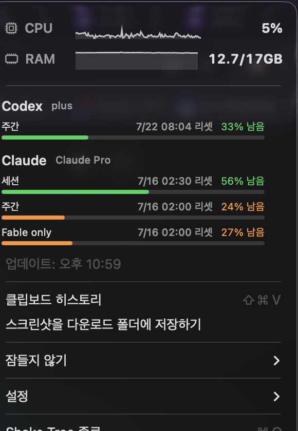

# Shake Tree 🌳

RunCat + CodexBar + Maccy + Amphetamine을 하나로 합친 개인용 macOS 메뉴바 앱입니다.
메뉴바에 상태 아이콘 여러 개가 늘어서는 게 싫어서, 자주 쓰던 기능들을 나무 아이콘 하나로
모았습니다. CPU 사용률이 높을수록 나무가 바람에 세게 흔들립니다 (산들바람 → 태풍).

> A personal all-in-one macOS menu bar app that merges RunCat + CodexBar + Maccy +
> Amphetamine into a single icon. Built because having four separate menu bar icons felt
> cluttered. The tree sways harder as CPU usage rises (light breeze → typhoon).

<p align="center">
  
</p>

## 기능 (Features)

| 기능 | 설명 |
|---|---|
| 🌳 흔들리는 나무 | CPU 사용률 = 바람 세기. 0.5초 간격 샘플링 + 제곱근 곡선이라 저·중간 CPU 구간에서도 변화가 잘 느껴짐. 평소엔 흑백(라이트/다크 메뉴바 자동 대응)이지만 CPU 95%↑ 또는 RAM 92%↑면 빨강, 80%↑면 주황으로 아이콘 자체가 물듦 |
| 📊 CPU·RAM 그래프 | 메뉴 맨 위에 아이콘+숫자+미니 그래프(최근 1분)로 CPU%, RAM 사용량(GB) 표시. RAM은 디스크 캐시 때문에 평소에도 70~80%가 정상이라 CPU보다 높은 경고 기준선 사용 |
| 🤖 Codex·Claude 사용량 | 세션/주간 "남은 %" 게이지 + 리셋 시각. 번들된 CLI로 조회 — **CodexBar 앱 설치 불필요** |
| 📋 클립보드 히스토리 | 텍스트·이미지·파일 지원, 검색, 핀 고정, **⇧⌘V**로 메뉴바 아래 드롭다운. 비밀번호 매니저가 복사한 항목은 기록 안 함 |
| ☕ 잠들지 않기 | 나무 **우클릭**으로 화면 잠자기 즉시 켜기/끄기(켜지면 아이콘에 점 표시), 좌클릭 메뉴에서 무기한/30분/1·2·4시간 지정 |
| 📸 스크린샷 | 두 가지 모드 — **다운로드+클립보드**(파일 저장 + 클립보드 자동 복사) 또는 **클립보드만**(파일 없이 바로 복사). 두 모드 다 캡처 후 뜨는 '미리보기 썸네일'을 꺼서 즉시 반영(썸네일이 켜져 있으면 파일 쓰기가 몇 초 늦어져 복사도 지연됨) |

<details>
<summary><b>English</b></summary>

| Feature | Description |
|---|---|
| 🌳 Swaying tree | CPU usage = wind strength. Sampled every 0.5s with a square-root response curve so changes are noticeable even in the low/mid CPU range. Monochrome by default (auto light/dark), turns red above CPU 95% / RAM 92%, orange above 80% |
| 📊 CPU/RAM graphs | Icon + number + 1-minute mini sparkline at the top of the menu. RAM uses a higher warning threshold than CPU since macOS keeps it at 70-80% as normal disk-cache behavior |
| 🤖 Codex/Claude usage | Session/weekly "remaining %" gauges with reset time, fetched via a bundled CLI — **no CodexBar.app install required** |
| 📋 Clipboard history | Text/image/file support, search, pinning, **⇧⌘V** dropdown anchored under the menu bar icon. Password-manager copies are never recorded |
| ☕ Keep awake | **Right-click** the tree to toggle sleep prevention instantly (a dot badge appears on the icon), or pick a duration from the left-click menu |
| 📸 Screenshots | Two modes — **Download + clipboard** (save a file and copy to the clipboard) or **clipboard only** (no file, copied directly). Both turn off the floating preview thumbnail so it lands instantly (the thumbnail otherwise delays the file write, and thus the copy, by several seconds) |

</details>

## 빌드 / 설치 (Build & Install)

```sh
scripts/install.sh    # release 빌드 → "/Applications/Shake Tree.app" 설치 + 실행
scripts/build-app.sh  # "dist/Shake Tree.app" 만 빌드
scripts/build-icon.sh # 앱 아이콘(Resources/AppIcon.icns) 재생성 — 디자인 바꿀 때만 실행
swift build           # 개발용 빌드
```

의존성은 Xcode 커맨드라인 툴체인뿐입니다. **다른 앱을 따로 설치할 필요가 없습니다** — Codex/Claude
사용량 조회에 쓰는 CLI(`vendor/codexbar-cli`, [steipete/CodexBar](https://github.com/steipete/CodexBar)
에서 추출한 것)를 앱 번들 안에 함께 넣어뒀습니다. Codex는 `~/.codex/auth.json`, Claude는 브라우저
쿠키에서 직접 읽습니다.

> **주의**: 번들된 `codexbar-cli`는 재서명하지 않습니다. 원본 서명을 유지해야 키체인(Chrome Safe
> Storage 등) 접근 권한이 살아있어 Claude 사용량을 읽을 수 있기 때문입니다. `build-app.sh`는 우리
> 실행 파일과 앱 번들만 ad-hoc 서명하고, 벤더 CLI는 건드리지 않습니다.

<details>
<summary><b>English</b></summary>

Only dependency is the Xcode command-line toolchain. **No other app needs to be
installed** — the CLI used for Codex/Claude usage lookups (`vendor/codexbar-cli`,
extracted from [steipete/CodexBar](https://github.com/steipete/CodexBar)) is bundled
inside the app itself. Codex reads from `~/.codex/auth.json`; Claude reads from browser
cookies directly.

> **Note**: the bundled `codexbar-cli` is intentionally left un-re-signed. Its original
> signature must be preserved for Keychain access (e.g. Chrome Safe Storage) to keep
> working, which is required to read Claude usage. `build-app.sh` only ad-hoc signs our
> own executable and the app bundle, not the vendored CLI.

</details>

## 사용법 (Usage)

- **⇧⌘V** — 클립보드 히스토리 드롭다운 (↑↓ 이동, ⏎ 붙여넣기, ⌘1–9 바로 선택, 우클릭 핀/삭제, esc 닫기)
- 메뉴바 나무 **좌클릭** — CPU/RAM + AI 사용량 게이지 + 메뉴
- 메뉴바 나무 **우클릭**(또는 control-클릭) — 잠들지 않기 즉시 토글
- 메뉴 → "스크린샷 저장 방식" — 다운로드+클립보드 / 클립보드만 중 선택 (선택 시 미리보기 썸네일이 꺼지고, 다시 켜려면 스크린샷 도구 옵션에서 '떠다니는 축소판 보기')
- 메뉴 → 설정 — 로그인 시 자동 실행, 히스토리 선택 시 자동 붙여넣기(접근성 권한 필요), 히스토리 비우기

## 권한 (Permissions)

- **다운로드/데스크탑 폴더 접근**: 스크린샷 감지에 필요 (최초 1회 macOS가 물어봄)
- **손쉬운 사용(Accessibility)**: "자동 붙여넣기"를 켤 때만 필요 (기본값은 복사만 하고 붙여넣기는 사용자가 직접)

## 스크립팅 트리거 (Scripting hooks)

디버깅/자동화용으로 실행 중인 앱에 분산 알림(distributed notification)을 보낼 수 있습니다.

```sh
SHAKETREE_POST=show-panel   "/Applications/Shake Tree.app/Contents/MacOS/ShakeTree"  # 클립보드 히스토리 열기
SHAKETREE_POST=show-menu    "/Applications/Shake Tree.app/Contents/MacOS/ShakeTree"  # 상태 메뉴 열기
SHAKETREE_POST=toggle-awake "/Applications/Shake Tree.app/Contents/MacOS/ShakeTree"  # 잠들지 않기 토글

SHAKETREE_DUMP=/tmp/frames          "/Applications/Shake Tree.app/Contents/MacOS/ShakeTree" # 흔들림 사이클 PNG 덤프
SHAKETREE_DUMP_WARNING=/tmp/warn    "/Applications/Shake Tree.app/Contents/MacOS/ShakeTree" # 경고색 미리보기 PNG
SHAKETREE_APPICON=/tmp/icon1024.png "/Applications/Shake Tree.app/Contents/MacOS/ShakeTree" # 앱 아이콘 소스 PNG 렌더
```

## 데이터 (Data)

클립보드 히스토리는 로컬 SQLite에만 저장되고 외부로 전송되지 않습니다:
`~/Library/Application Support/ShakeTree/clipboard.sqlite` (최대 500개 + 핀 고정 항목)

## 참고한 오픈소스 (Credits)

- [steipete/CodexBar](https://github.com/steipete/CodexBar) (MIT) — 사용량 조회 CLI를
  `vendor/codexbar-cli`로 번들해서 그대로 사용. 라이선스 전문은
  [`vendor/CODEXBAR_LICENSE.txt`](vendor/CODEXBAR_LICENSE.txt), 고지는
  [`THIRD_PARTY_NOTICES.md`](THIRD_PARTY_NOTICES.md) 참고
- [p0deje/Maccy](https://github.com/p0deje/Maccy) (MIT) — 클립보드 감시 방식(폴링 주기,
  `org.nspasteboard.*` 비공개 타입 처리)을 참고. 코드를 그대로 가져오지는 않음

## 라이선스 (License)

MIT — [`LICENSE`](LICENSE) 참고. 번들된 서드파티 구성 요소는
[`THIRD_PARTY_NOTICES.md`](THIRD_PARTY_NOTICES.md)에 별도 고지되어 있습니다.

---

<sub>저장소 루트 폴더명만 개발 초기 이름(`quakka`)이 히스토리상 남아 있고, 앱 이름·번들·프로세스는
모두 <b>Shake Tree</b> / <code>ShakeTree</code>입니다.</sub>
